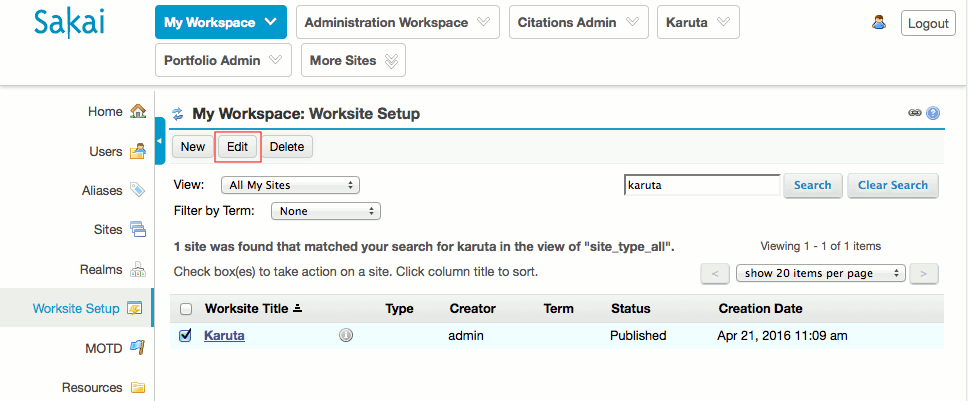
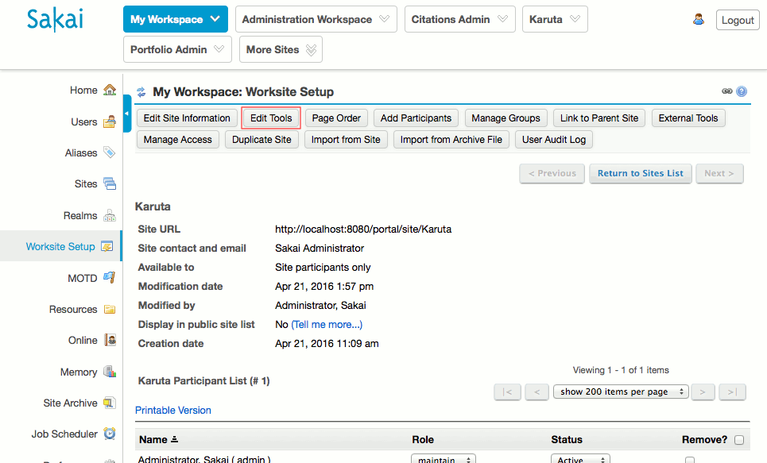
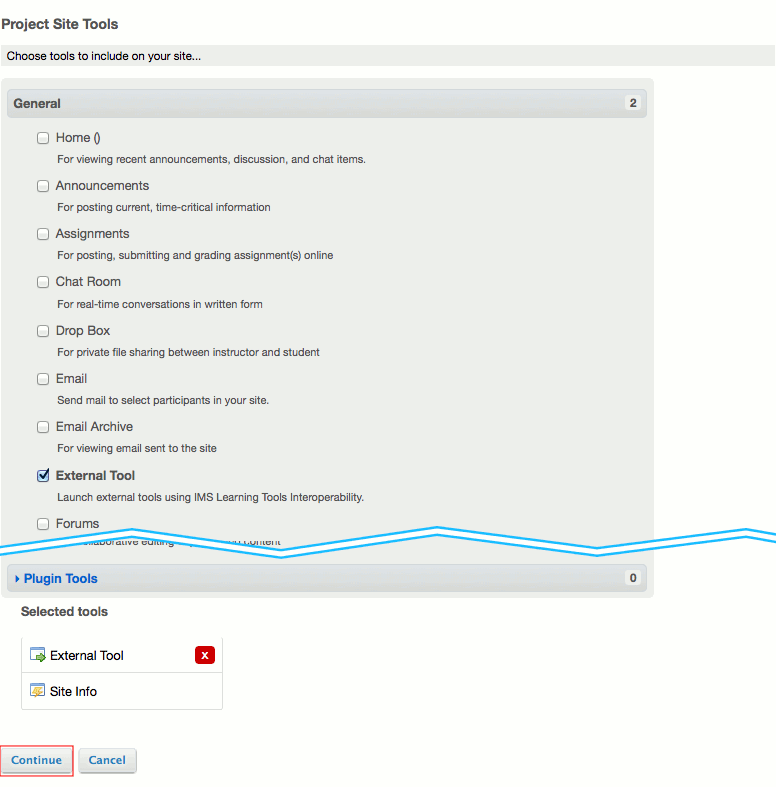
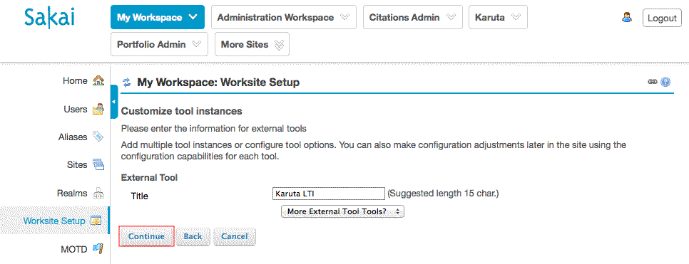
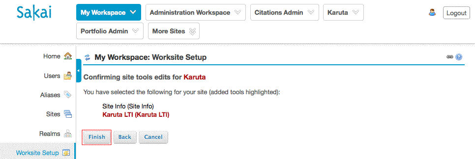
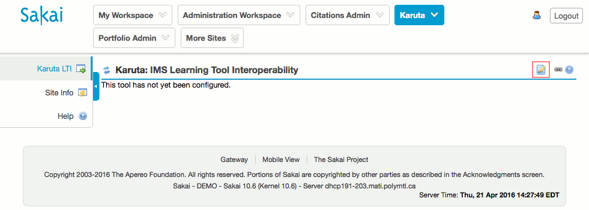
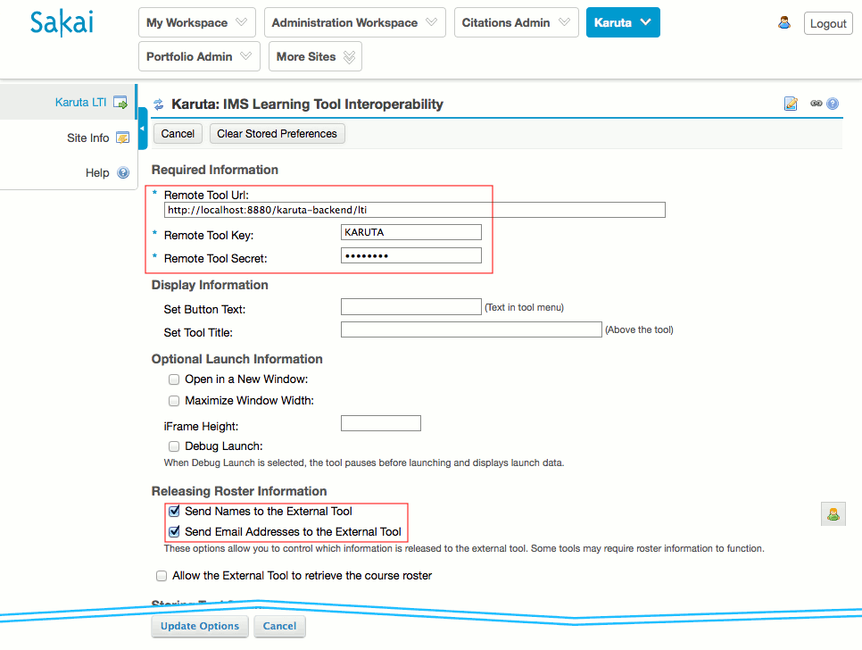
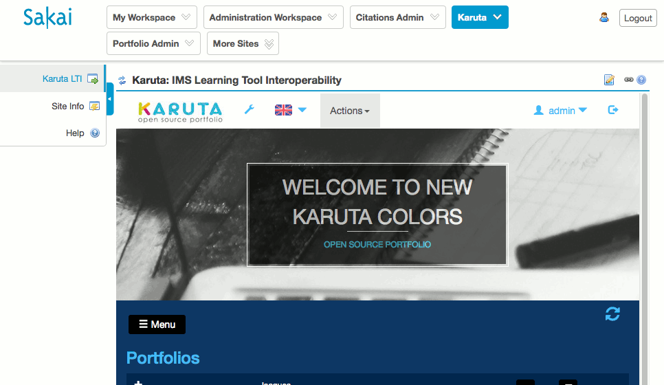
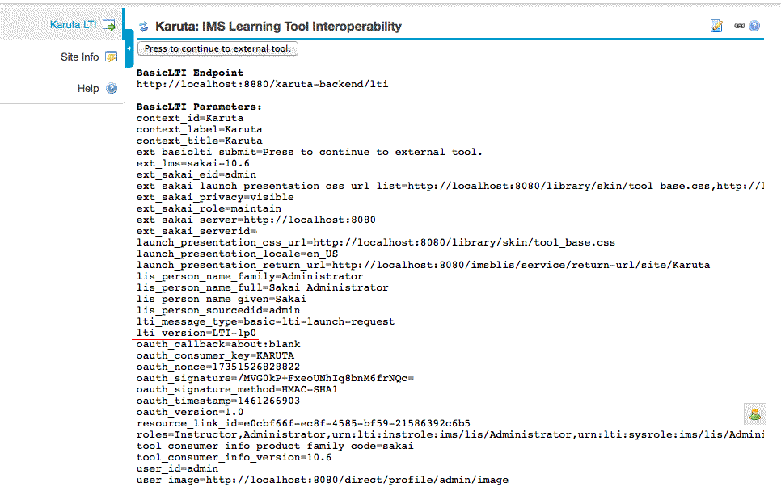

Karuta in Sakai via LTI 1.x
=

Tested with Sakai 10.6

1\. Editing the worksite

Select the worksite you want to add Karuto to.

2\. Edit tools

Edit the tools that it contains

3\. Select tool

Select 'External tools' and continue.

4\. Add tool

Add a title, continue.

5\. Finish add tool

Finish.

6\. Configure tool

Inside the worksite, configure the tool

7\. Finish configure tool

Input the remote tool information (the same than in configKaruta.properties) and check the following checkboxes

8\. LTI view

The system will log you as the username from Sakai inside Karuta. You can prepare the portfolios and accounts using the batch tools.

9\. Showing the debug view

When checking the debug view, the version shows 'LTI-1p0' 

