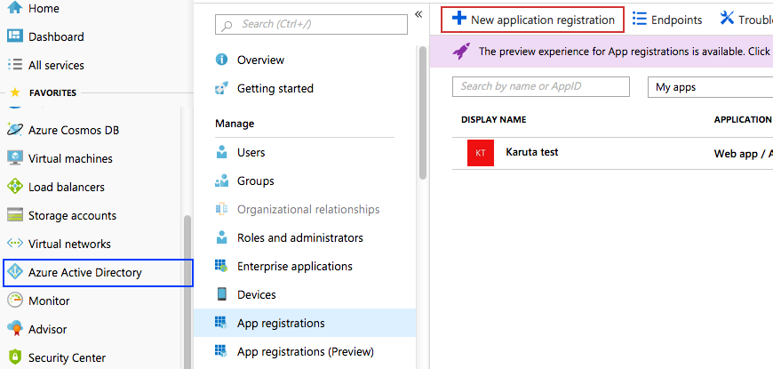
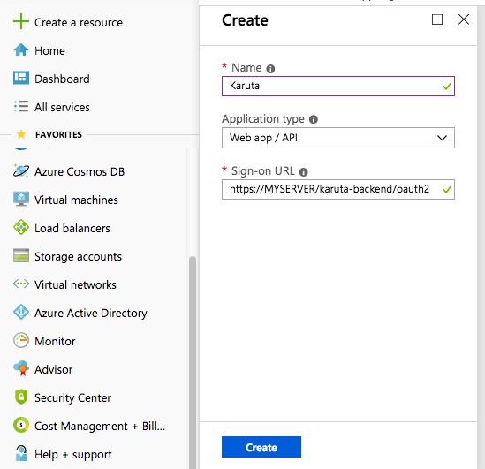
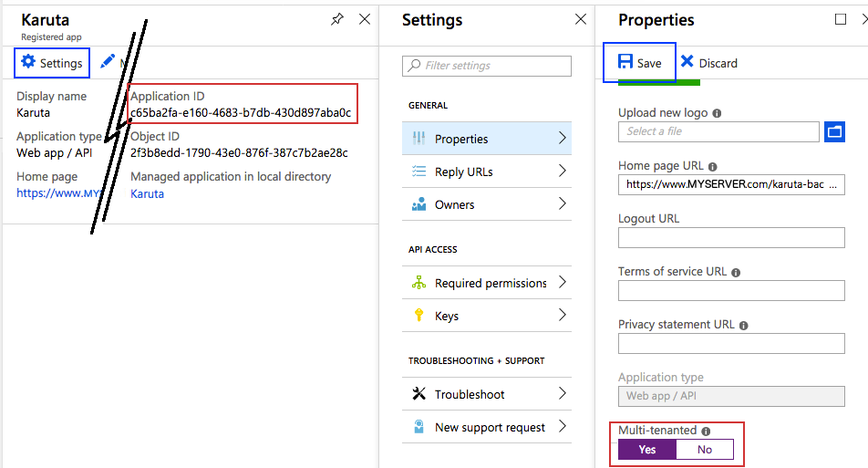
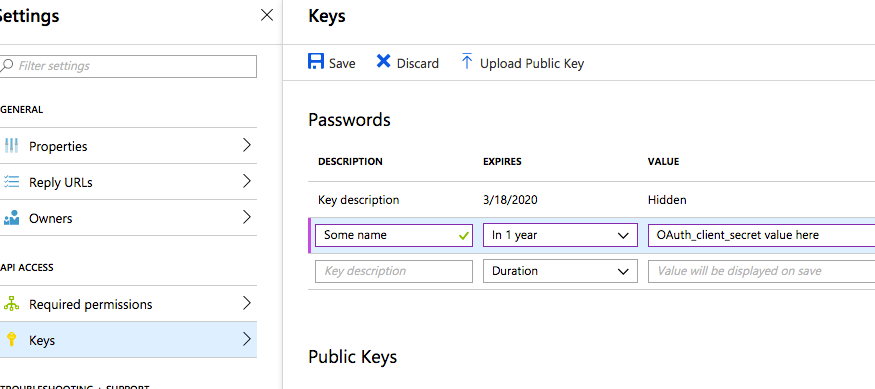
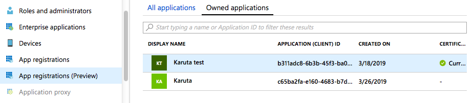
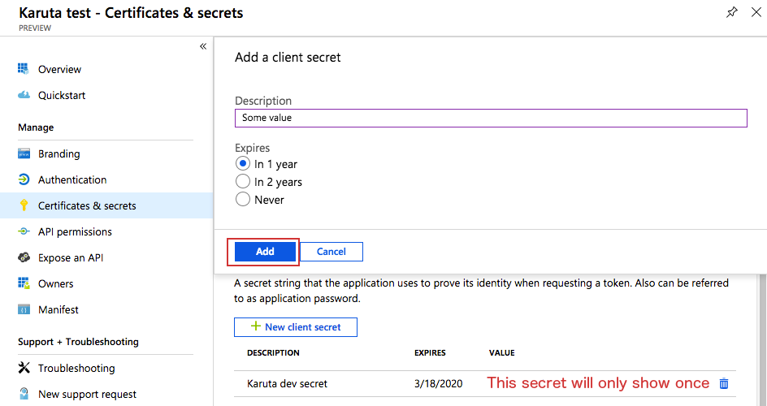

#Configuring OAUth2 in Karuta

Screencap show Azure, but the concept should remain the same on any authenticating server

#### 1. First create a new app


#### 2. Fill in basic info


 For Azure, you will need to activate "Multi-tenant" inside the application settings, properties. Don't forget to save.
Note that you will need the application id value later on


#### 3. Create an application secret


 If you don't trust your entropy, you can generate a value within the preview registration menu (as of march 26th 2019)
Keep in mind the generated value is only showed once.



#### 4. Editing configKaruta.properties
For Azure, the key URL should be `https://login.microsoftonline.com/common/discovery/keys`
```
# ==== OAuth2 service =====
#URLAuthorize=https://AUTHSERVER/oauth2/v2/authorize
#URLToken=https://AUTHSERVER/oauth2/v2/token
#URLKeys=https://AUTHSERVER/discovery/keys
# Application id
#OAUth_client_id=MY_APPLICATION_ID
#OAuth_client_secret=MY_APPLICATION_SECRET
#OAuth_scope=openid+profile+offline_access

# In case the UI has been deployed under a different name
ui_redirect_location=/karuta/application/htm/karuta.htm
```
