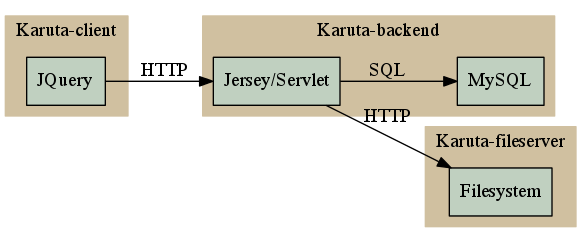

# Karuta Structure

Separating the fileserver give the possibility to change it to something else if needed.
The database call is also behind an interface, so different database can be supported, still have to be coded though.

# Contributing
## Coding
Improving the backend, here's a 
[Link](./CONTRIBUTING.md)
to the code general organization

## REST API
If you want to make a client, here's a
[list](REST_API.md)
of the REST calls

## Database
Simplified view of the database
